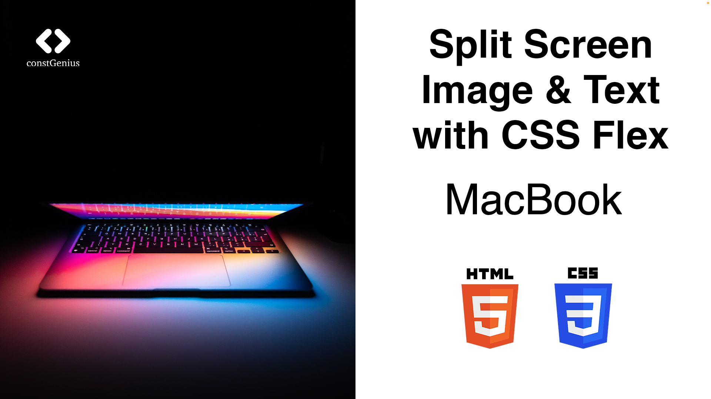

# Split Screen Image & Text with CSS Flex | HTML CSS

This layout features a split-screen design using CSS Flexbox, which divides the web page into two sections. One section contains an image, while the other section contains text. This approach allows for a visually appealing presentation where the image and text complement each other, creating an engaging and balanced user experience.

